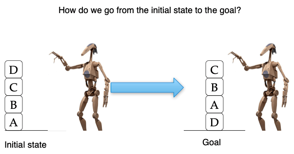
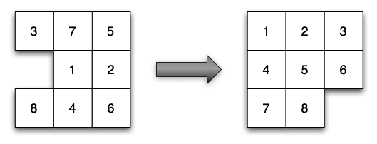
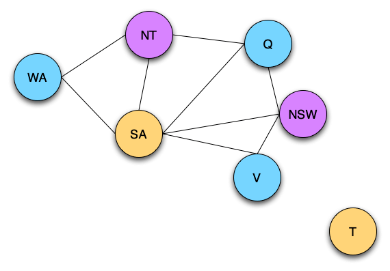
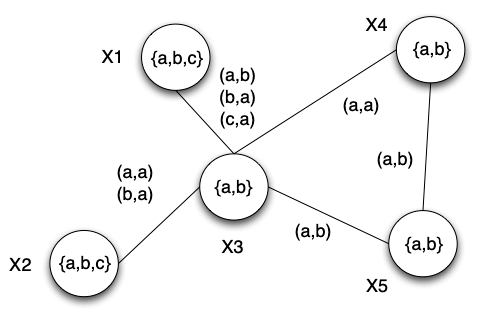
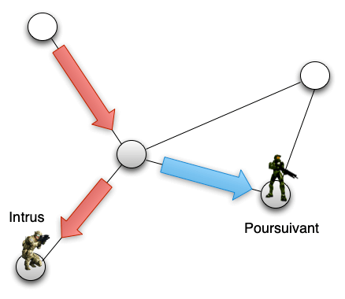
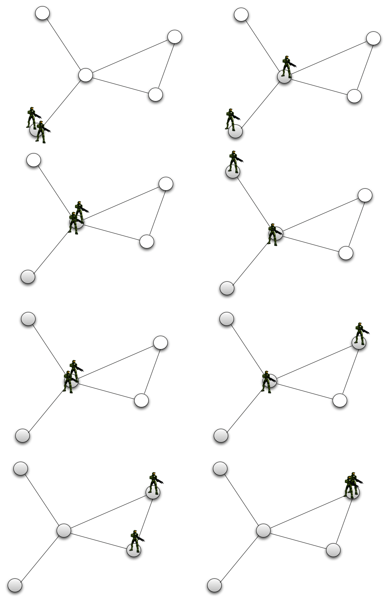
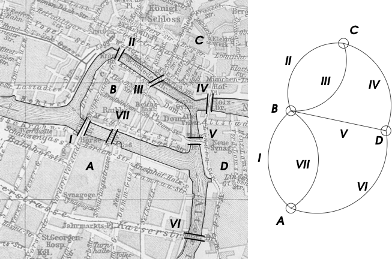

PDDL Domain & Problem Syntax
============================

The objective of these exercises is to use PDDL syntax to write domains and problems of automated planning.

Exercise 1: Blocksworld
-----------------------

One famous domain in automated planning is blocksworld. In this domain, a robotic arm manipulates blocks placed on a table. It can pickup a block from the table, stack it on top of another block and build piles. Likewise, it can unstack
a block, put it down or stack it on another pile etc.

In the bloksworld domain, the initial state and the goal are two different pile configurations. The planner is used to find the sequence of actions that have to be performed to get from the initial configuration to the goal.

A blocksworld domain file as well as many problem files are available here_

- Open these files and study the pddl code
- Test these files with the PDDL4J default planner
- Write your own blocksworld problem and test it! Does the planner find the correct plan?

.. _here: https://github.com/pellierd/pddl4j/tree/devel/src/test/resources/benchmarks/pddl/ipc2000/blocks/strips-typed

Exercise 2: Tower of Hanoi
--------------------------

The Tower of Hanoi is a mathematical game or puzzle consisting of three rods and a number of disks of various diameters, which can slide onto any rod. 
The puzzle begins with the disks stacked on one rod in order of decreasing size, the smallest at the top, thus approximating a conical shape. 
The objective of the puzzle is to move the entire stack to the last rod, obeying the following rules:

- Only one disk may be moved at a time.
- Each move consists of taking the upper disk from one of the stacks and placing it on top of another stack or on an empty rod.
- No disk may be placed on top of a disk that is smaller than it.

The minimal number of moves required to solve a Tower of Hanoi puzzle is :math:`2^n − 1`, where n is the number of disks. (From Wikipedia)

.. image:: img/Tower_of_Hanoi_4.gif

- Taking inspiration from blocksworld, write the domain and problem files to solve the Tower of Hanoi with 4 disks.

Exercise 3: N-puzzle
--------------------

The 15 puzzle is a sliding puzzle having 15 square tiles numbered 1–15 in a frame that is 4 tiles high and 4 tiles wide, leaving one unoccupied tile position. 
Tiles in the same row or column of the open position can be moved by sliding them horizontally or vertically, respectively. 
The goal of the puzzle is to place the tiles in numerical order.

Named for the number of tiles in the frame, the 15 puzzle may also be called a 16 puzzle, alluding to its total tile capacity. 
Similar names are used for different sized variants of the 15 puzzle, such as the 8 puzzle that has 8 tiles in a 3 × 3 frame. (From Wikipedia)

The N-puzzle is a classical problem for modelling algorithms involving heuristics as, for instance, automated planning.

- Write the domain and problem files to solve the 15-puzzle.

Exercise 4: Graph coloring
--------------------------

In graph theory, coloring a graph means assigning a color to each of its vertices so that two vertices connected by an edge are of different colors. 
The aim is to use a minimum number of colors. A graph with a minimum of 2 colors has a *chromatic number* of 2.

This figure is the map of Australia with its representation in the form of a graph. In this case, the color number is 3.

Formally, finding the chromatic number of a graph is equivalent to solving a Constraint Satisfaction Problem. A Constraint Satisfaction Problem is defined by a triplet *(X,D,C)* where *X* is a set of variables, *D* is a domain of values and *C* is a set of constraints. Each constraint is in turn a pair *(t,R)*, where *t* is a tuple of variables and *R* is a set of tuples of possible values, all these tuples having the same number of elements. 
 
Thus *R* defines a relation. An evaluation of variables is a function from variables to domains, :math:`v: X \rightarrow D`. Such an evaluation satisfies a constraint :math:`((x_1,\cdots,x_n),R)` if :math:`(v(x_1),\cdots,v(x_n))\in R`. A solution is an evaluation that satisfies all the constraints. For example, in figure below, the domain of :math:`x_1` is :math:`\{a,b,c\}`, 
that of :math:`x_3` is :math:`\{a,b\}` and :math:`((x_1,x_3),\{(a,b),(b,a),(c,a)\})` is a constraint :math:`v(x_1)=c`, :math:`v(x_2)=b`, :math:`v(x_3)=a`, :math:`v(x_4)=a` and :math:`v(x_5)=b` is a solution.

- Code and test a planning domain to solve the coloring of a graph.

Exercise 5: Pursuit-Evasion
---------------------------

The "Pursuit-Evasion" problem is a game played on a graph in which an intruder and pursuers are moving. 
The objective of the pursuers is to capture the intruder. This is achieved when a pursuer and the intruder are on the same node.

The intruder moves at an infinite speed while the pursuers explore each node of the graph. The intruder can therefore place himself on nodes already explored by his pursuers (see figure). 
A winning strategy for the pursuers consists in finding a displacement plan such that, whatever the movements of the intruder, he will eventually be captured. 
It is easy to see that not all game configurations (graph and number of pursuers) have a winning strategy (see figure). The above figure gives an example of a winning strategy.

- Code and test a planning domain to find a solution for a game of "Pursuit-Evasion".

Exercise 6: Hamiltonian cycle
-----------------------------
In graph theory, a Hamiltonian graph is a graph with at least one cycle passing through all vertices one and only one time. Such an elementary cycle is then called a Hamiltonian cycle.

- Represent in PDDL the initial state corresponding to the graph of the figure above (the city of Königsberg). Is there a Hamiltonian cycle?
- Represent in PDDL the goal corresponding to the existence of a Hamiltonian cycle, whatever this graph is. In other words, the goal must not represent the solution of a given problem but a state representing the existence of a Hamiltonian cycle,
- Represent in PDDL the actions necessary to find a Hamiltonian cycle.

Exercise 7: Turing Machine
--------------------------

A Turing Machine (TM) is a mathematical model of computation describing an abstract machine that manipulates symbols on a strip of tape according to a table of rules. 
Despite the model's simplicity, it is capable of implementing any computer algorithm.

The machine operates on an infinite memory tape divided into discrete cells, each of which can hold a single symbol drawn from a finite set of symbols called the alphabet of the machine. 
It has a "head" that, at any point in the machine's operation, is positioned over one of these cells, and a "state" selected from a finite set of states. 
At each step of its operation, the head reads the symbol in its cell. Then, based on the symbol and the machine's own present state, the machine writes a symbol into the same cell, and moves the head one step to the left or the right, or halts the computation. 
The choice of which replacement symbol to write and which direction to move is based on a finite table that specifies what to do for each combination of the current state and the symbol that is read. (Wikipedia)

More formally, :math:`\Gamma = \{s_0,s_1,\dots,s_n\}` is the finite set of symbols. The set of word on :math:`\Gamma` is noted :math:`\Gamma^{*}`. Usually, :math:`s_0` is the blank character :math:`\sqcup`. Initially, all the cells of the infinite memory tape are blank except a finite number.
At a given time, the TM is in a state :math:`z_i` from a finite set :math:`Z = \{z_0,z_1,\dots,z_h\}`: :math:`z_0` is the initial state, and :math:`z_h` is the halt/final state. The transition function :math:`\delta` is as follows:

.. math:: \delta : (Z - \{z_h\}) \times \Gamma \rightarrow Z \times \Gamma \times \{L, R, I\}

:math:`\delta(z,s)=(z',s',L)` means that, if the MT is in the state *z* et reads symbol *s* then it shifts to state *z'*, write in the current cell *s'* instead of *s* and moves to the *L* eft cell (*R* for right and *I* for idle). Whenever the MT shifts to :math:`z_h`, the computation is over.
A MT is totally defined by the tuple :math:`(\Gamma, Z, \delta, z_0, z_h)`.

- Verify that the following MT computes *x + 1* when *x* is a binary number written on the memory tape:

============== ======================== ================= =================
:math:`\delta` | :math:`\sqcup`         :math:`0`         :math:`1`
============== ======================== ================= =================
:math:`z_0`    | :math:`(z_1,\sqcup,L)` :math:`(z_0,0,R)` :math:`(z_0,1,R)`
:math:`z_1`    | :math:`(z_h,1,I)`      :math:`(z_h,1,I)` :math:`(z_1,0,L)`
============== ======================== ================= =================

- Write a PDDL domain and problem that emulates this MT by defining the actions as the transition function of the MT.
- Write a PDDL domain that can emulate any MT. Test it by encoding the previous MT in the PDDL problem. 

Exercise 8: SAT solver
----------------------

Let :math:`x_i` represent propositional variables that can assume only values *true* or *false*. A *clause* is a disjunction of propositional variables or their negation: 

.. math:: (x_1 \vee x_3 \vee \bar{x}_4)

A formula in Conjunctive Normal Form (CNF) is a conjunction of clauses:

.. math:: (x_1 \vee x_3 \vee \bar{x}_4)\wedge(x_4)\wedge(x_2 \vee \bar{x}_3)

Given a formula in CNF, a SAT problem consists in finding whether there is an assignment of values to the propositional variables so that the formula evaluates to *true*. In the above example, a solution is :math:`x_1 = x_2 = x_4 = true`.

It is worth noting that, if we assign the *true* value to a variable :math:`x_i`, all the clauses containing this variable can be removed from the SAT formula to solve, and :math:`\bar{x}_i` can be removed from the clauses containing it. Likewise, if we assign the *false* value to a variable :math:`\bar{x}_i`, all the clauses containing this variable can be removed from the SAT formula to solve, and :math:`x_i` can be removed from the clauses containing it. 

This gives a procedure named David-Putnam to solve SAT formulas consisting in assigning values to the variables until no more clause is left in the SAT formula. The procedure fails if all the variables of a clause are removed.

- Devise a PDDL domain allowing to solve SAT formulas based on this procedure.

