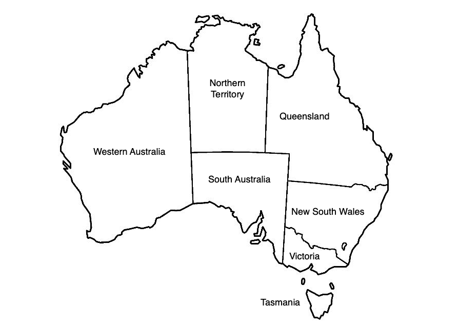

PDDL Domain & Problem Syntax
============================

The objective of these exercises is to use PDDL syntax to write domains and problems of automated planning.

Exercise 1: Blocksworld
-----------------------

One famous domain in automated planning is blocksworld. In this domain, a robotic arm manipulates blocks placed on a table. It can pickup a block from the table, stack it on top of another block and build piles. Likewise, it can unstack
a block, put it down or stack it on another pile etc.

.. image:: img/bw.png

In the bloksworld domain, the initial state and the goal are two different pile configurations. The planner is used to find the sequence of actions that have to be performed to get from the initial configuration to the goal.

A blocksworld domain file as well as many problem files are available here_

- Open these files and study the pddl code
- Test these files with the PDDL4J default planner
- Write your own blocksworld problem and test it! Does the planner find the correct plan?

.. _here: https://github.com/pellierd/pddl4j/tree/devel/src/test/resources/benchmarks/pddl/ipc2000/blocks/strips-typed

Exercise 2: Tower of Hanoi
--------------------------

The Tower of Hanoi is a mathematical game or puzzle consisting of three rods and a number of disks of various diameters, which can slide onto any rod. 
The puzzle begins with the disks stacked on one rod in order of decreasing size, the smallest at the top, thus approximating a conical shape. 
The objective of the puzzle is to move the entire stack to the last rod, obeying the following rules:

- Only one disk may be moved at a time.
- Each move consists of taking the upper disk from one of the stacks and placing it on top of another stack or on an empty rod.
- No disk may be placed on top of a disk that is smaller than it.

The minimal number of moves required to solve a Tower of Hanoi puzzle is :math:`2^n − 1`, where n is the number of disks. (From Wikipedia)

.. image:: img/Tower_of_Hanoi_4.gif

- Taking inspiration from blocksworld, write the domain and problem files to solve the Tower of Hanoi with 4 disks.

Exercise 3: N-puzzle
--------------------

The 15 puzzle is a sliding puzzle having 15 square tiles numbered 1–15 in a frame that is 4 tiles high and 4 tiles wide, leaving one unoccupied tile position. 
Tiles in the same row or column of the open position can be moved by sliding them horizontally or vertically, respectively. 
The goal of the puzzle is to place the tiles in numerical order.

Named for the number of tiles in the frame, the 15 puzzle may also be called a 16 puzzle, alluding to its total tile capacity. 
Similar names are used for different sized variants of the 15 puzzle, such as the 8 puzzle that has 8 tiles in a 3 × 3 frame. (From Wikipedia)

The N-puzzle is a classical problem for modelling algorithms involving heuristics as, for instance, automated planning.

- Write the domain and problem files to solve the 15-puzzle.

Exercise 4: Graph coloring
--------------------------

In graph theory, colouring a graph means assigning a colour to each of its vertices so that two vertices connected by an edge are of different colours. 
The aim is to use a minimum number of colours. A graph with a minimum of 2 colours has a *chromatic number* of 2.

This figure is the map of Australia with its representation in the form of a graph. In this case, the color number is 3.

.. image:: img/australia_coloring.png

Formally, finding the chromatic number of a graph is equivalent to solving a Constraint Satisfaction Problem. A Constraint Satisfaction Problem is defined by a triplet *(X,D,C)* where *X* is a set of variables, *D* is a domain of values and *C* is a set of constraints. Each constraint is in turn a pair *(t,R)*, where *t* is a tuple of variables and *R* is a set of tuples of possible values, all these tuples having the same number of elements. 
 
Thus *R* defines a relation. An evaluation of variables is a function from variables to domains, :math:`v: X \rightarrow D`. Such an evaluation satisfies a constraint :math:`((x_1,\cdots,x_n),R)` if :math:`(v(x_1),\cdots,v(x_n))\in R`. A solution is an evaluation that satisfies all the constraints. For example, in figure below, the domain of :math:`x_1` is :math:`\{a,b,c\}`, 
that of :math:`x_3` is :math:`\{a,b\}` and :math:`((x_1,x_3),\{(a,b),(b,a),(c,a)\})` is a constraint :math:`v(x_1)=c`, :math:`v(x_2)=b`, :math:`v(x_3)=a`, :math:`v(x_4)=a` and :math:`v(x_5)=b` is a solution.

.. image:: img/csp.png

- Code and test a planning domain to solve the colouring of a graph.

Exercise 5: Pursuit-Evasion
---------------------------

Exercise 6: Turing Machine
--------------------------

Exercise 7: SAT solver
----------------------