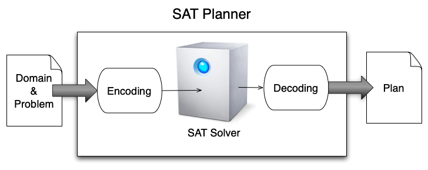

SAT Planning
============

Rather than directly solving a planning problem, a good idea could be to transform it into another well-known and tackled problem. This is a traditional strategy in science, to look for relations or equivalences between statements. One possible equivalence for planning problems is towards SAT problems.

Let :math:`x_i` represent propositional variables that can assume only values *true* or *false*. A *clause* is a disjunction of propositional variables or their negation: 

.. math:: (x_1 \vee x_3 \vee \bar{x}_4)

A formula in Conjunctive Normal Form (CNF) is a conjunction of clauses:

.. math:: (x_1 \vee x_3 \vee \bar{x}_4)\wedge(x_4)\wedge(x_2 \vee \bar{x}_3)

Given a formula in CNF, a SAT problem consists in finding whether there is an assignment of values to the propositional variables so that the formula evaluates to *true*. In the above example, a solution is :math:`x_1 = x_2 = x_4 = true`.

Exercise 1: SAT planner
-----------------------

Teamwork for groups of 2 students. The code must be delivered on Github or an equivalent versioning tool.
  
You must implement your own SAT planner in PDDL4J. To that end, please follow the instructions given in the PDDL4J tutorial, section "Implement your own planner". 
The code must be written in Java and properly documented. You do not have the implement a SAT solver. Please use SAT4J instead (see https://www.sat4j.org). 
Thus, your work will focus on the encoding of a planning problem into a SAT problem, and the decoding procedure that expresses the SAT solution as a plan. 

Check plan validity with VAL (https://github.com/KCL-Planning/VAL). Details on the coding/decoding procedures are given in this book: "Automated Planning, theory and practise", chapter 7.

Then, write a script (in bash shell, Python or Java only) to compare the performances of your SAT planner with that of HSP (PDDL4J A* planner). 
The comparison will be made using the 4 benchmarks (blocksworld, depot, gripper and logistics) provided in PDDL4J. You will use 2 metrics: the total runtime and the makespan (plan length). 
Represent your results as follows: problems on X axis ordered from the simplest to the most difficult for HSP. And, on Y axis the results of both HSP and your planner. 
Make a figure for each domain and each metric (in total, 8 figures). Which one is the best?

Include the script in the Github repository as well as the figures of yours results in a pdf document with the names of all the group students and the link to your repository.

Exercise 2: SAT encoding
------------------------

As mentioned in Section "PDDL Domain & Problem syntax", it is possible to solve SAT problems with planners. And, one possibility is to use a SAT planner. The question is then the following: What is the link between the SAT formula to be solved and its SAT encoding?
In random 3SAT instances, each clause has at most 3 different variables, and it is randomly generated by the uniform distribution according to the clause/variable ratio r. Empirical studies show that the hardness to solve 3SAT problems embraces a ”easy-hard-easy”/"transition phase" phenomenon depending on the clause/variable ratio r:

- Formulas with a low clause/variable ratio cane asily be solved,
- Formulas with a high clause/variable ratio can easily be solved,
- Formulas with a middle clause/variable ratio are hard to solve.
   
The phase transition point r is believed to be around 4.27

In your opinion, will the encoded random 3SAT formulas be harder to solve than the original instances? Will it be easier? Or will they have no impact on the hardness?