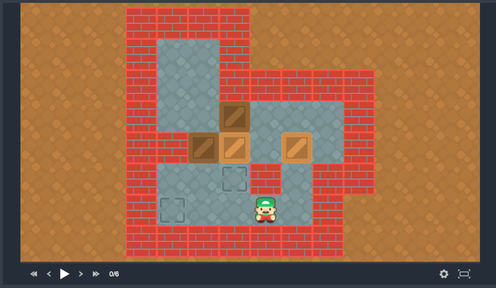

Sokoban
=======

Sokoban (倉庫番, Sōko-ban, lit. "warehouse guard") is a puzzle video game invented in Japan. As a warehouse keeper (divided into square boxes), the player must arrange boxes on target boxes. 
He/She can move in all four directions, and push (but not pull) one crate at a time. Once all the crates have been put away (sometimes a real puzzle), the level is completed and the player moves 
on to the next level, which is usually more difficult. The ideal is to succeed with as few moves as possible (moves and pushes).

It has been shown that solving the levels of Sokoban is an NP-hard problem, in the sense that the game belongs to the more general class of move planning problems, where the player is allowed to push 
or pull one or more objects at a time. The game is also of interest to artificial intelligence researchers, as solving levels poses difficult problems, for which no fast solving algorithms exist to date. 
For example, work has shown that the general version of Sokoban is included in the space of PSPACE-complete problems.

- Install the sokoban interface as indicated here_. Then launch a web navigator at http://localhost:8888/test.html. The above window should appear:

- Many different levels are provided at https://github.com/fiorinoh/sokoban/tree/master/config in files test*.json. Here is the meanings of the characters: \# is a wall, \$ is a box, \. is a destination, \* is a box on a storage place, \@ is the warehouse guard, \+ is this guard on a storage place and a space character is the floor.
- The method Agent_ executes the plan encoded in the String solution as follows: U is up, D is down, L is left and R is right. 
- Write a PDDL Sokoban domain and a Java program that:

    - reads Sokoban levels and encode them as a PDDL problem,
    - integrates a PDDL4J planner,
    - solves the Sokoban level and executes the solution on the Sokoban interface.

.. _here: https://github.com/fiorinoh/sokoban
.. _Agent: https://github.com/fiorinoh/sokoban/blob/master/src/main/java/sokoban/Agent.java